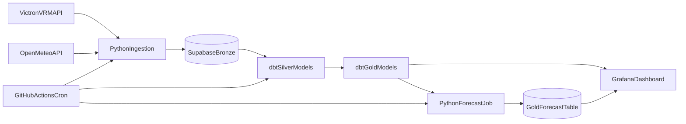

# Arhitektuuriskeem

## Andmeallikad

- Victron VRM API: telemeetriaandmed 
- Open-Meteo API: ilmavaatlused/prognoosid

## Tehnilised kokkulepped

- Ajatsoon: UTC
- Granulaarsus: 1h
- Võtmed: `site_id + timestamp_utc`
- Idempotentsus: upsert (`ON CONFLICT DO UPDATE`)
- Kihid: `bronze -> silver -> gold`
