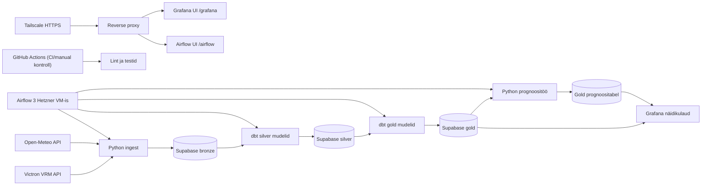

# Off-grid päikeseelektrijaama telemeetria ja ilmaprognoosi analüütikaplatvorm

## Äriküsimus

Kuidas mõjutavad ilmastikutingimused off-grid paigaldise energiatootmist ning kui
täpselt on võimalik prognoosida järgmise päeva päikeseenergia tootmist?

**Mõõdikud:**
1. Järgmise päeva tootmise prognoosiviga (MAE, kWh).
2. Tegeliku ja prognoositud päevase tootmise erinevus (kWh).
3. Tegeliku ja prognoositud päevase tootmise erinevus (%).

## Arhitektuur



Täpsem kirjeldus: see dokument

## Andmestik

| Allikas | Tüüp | Ajas muutuv? | Roll |
|---------|------|-------------|------|
| VRM API | API | Jah, iga 15 min tagant | Põhiandmevoog |
| Open Meteo | API | Jah, ilmamudel uueneb iga 6h tagant | Kõrvalvoog |

## Stack

| Komponent | Tööriist |
|-----------|---------|
| Server | Hetzner VM 2 vCPU 4 GB RAM 40 GB SSD |
| Sissevõtt | Airflow, Python |
| Transformatsioon | SQL, dbt |
| Andmehoidla | PostgreSQL |
| Prognoos | Python |
| Näidikulaud | Grafana (Hetzner VM, Tailscale ligipääs) |
| Orkestreerimine | Airflow |

## Käivitamine

### Kohalik arendus (`docker-compose.yml`)

```bash
# 1. Kopeeri keskkonnamuutujad
cp .env.example .env
# Täida .env failis vajalikud väärtused

# 2. Ehita arenduskonteiner
docker compose build

# 3. Kontrolli dbt paigaldust ja ühendust
docker compose run --rm dev dbt --version
docker compose run --rm dev dbt debug

# 4. Vajadusel käivita Python käsud
docker compose run --rm dev python --version
```

### Airflow 3 stack (`airflow/docker-compose.airflow.yml`)

Teenused:
- `airflow-postgres` (metadata andmebaas)
- `airflow-init` 
- `airflow-apiserver`
- `airflow-scheduler`
- `airflow-dag-processor`

Käivitusjärjekord:
1. `airflow-postgres` peab olema püsti.
2. `airflow-init` peab lõppema edukalt.
3. Seejärel käivituvad `airflow-apiserver`, `airflow-scheduler`, `airflow-dag-processor`.

Käivita:
1. `docker compose --env-file .env -f airflow/docker-compose.airflow.yml build`
2. `docker compose --env-file .env -f airflow/docker-compose.airflow.yml up -d airflow-init`
3. `docker compose --env-file .env -f airflow/docker-compose.airflow.yml up -d`

Airflow UI:
- Port on seotud localhostile (`127.0.0.1:8080`).
- Väline ligipääs käib reverse proxy kaudu URL-il `https://<tailscale-host>/airflow`.

Connections/Variables bootstrap:
- `docker compose --env-file .env -f airflow/docker-compose.airflow.yml run --rm airflow-apiserver bash /opt/airflow/project/airflow/scripts/bootstrap_connections.sh`

### Grafana stack (`grafana/docker-compose.grafana.yml`)

Teenused:
- `grafana` (näidikulaud + Supabase datasource provisioning)

Käivita:
1. `docker compose --env-file .env -f grafana/docker-compose.grafana.yml config`
2. `docker compose --env-file .env -f grafana/docker-compose.grafana.yml up -d`
3. `docker compose --env-file .env -f grafana/docker-compose.grafana.yml ps`

Grafana UI:
- Port on seotud localhostile (`127.0.0.1:3000`).
- Väline ligipääs käib reverse proxy kaudu URL-il `https://<tailscale-host>/grafana`.

### Reverse proxy stack (`proxy/docker-compose.proxy.yml`)

Teenused:
- `reverse-proxy` (Nginx path routing)

Käivita:
1. `docker compose --env-file .env -f proxy/docker-compose.proxy.yml up -d`
2. `tailscale serve --bg http://127.0.0.1:8088`
3. `tailscale serve status`

URL-id:
- `https://<tailscale-host>/` (landing page)
- `https://<tailscale-host>/airflow`
- `https://<tailscale-host>/grafana`

## Saladused ja konfiguratsioon

Põhireegel:
- Saladused hoitakse ainult `.env` failis.
- Repositooriumis hoitakse ainult `.env.example`.
- `.env` faili ei commitita.
- Saladusi ei hardcode'ita DAG-idesse.

Nõutud peamised muutujad:

### Supabase / Postgres
- `SUPABASE_DB_HOST`
- `SUPABASE_DB_PORT`
- `SUPABASE_DB_NAME`
- `SUPABASE_DB_USER`
- `SUPABASE_DB_PASSWORD`

### Victron VRM
- `VRM_API_TOKEN`
- `VRM_SITE_ID`

### Open-Meteo
- `METEO_LAT`
- `METEO_LON`
- `METEO_TIMEZONE`

### Üldised
- `SITE_ID`
- `PYTHONUNBUFFERED`

### Airflow admin
- `AIRFLOW_ADMIN_USER`
- `AIRFLOW_ADMIN_PASSWORD`
- `AIRFLOW_ADMIN_EMAIL`
- `AIRFLOW_BASE_URL`

### Airflow auth/API
- `AIRFLOW__CORE__AUTH_MANAGER`
- `AIRFLOW__API__SECRET_KEY`
- `AIRFLOW__API_AUTH__JWT_SECRET`

### Grafana
- `GRAFANA_ADMIN_USER`
- `GRAFANA_ADMIN_PASSWORD`
- `GRAFANA_PORT`
- `GRAFANA_DOMAIN`
- `GRAFANA_ROOT_URL`
- `GF_SERVER_SERVE_FROM_SUB_PATH`
- `GRAFANA_SUPABASE_SSLMODE`
- `GRAFANA_SUPABASE_DB_SCHEMA`

## Andmevoog lühidalt

1. **Sissevõtt** — [Kirjelda, kuidas andmed allikast kätte saadakse]
2. **Laadimine** — Andmed laaditakse `staging` kihti
3. **Transformatsioon** — [Kirjelda peamised arvutused ja mudelid]
4. **Testimine** — [Mitu] andmekvaliteedi testi kontrollivad korrektsust
5. **Näidikulaud** — [Kirjelda lühidalt, mida näidikulaud näitab]

## Andmekvaliteedi testid

Projekt kontrollib järgmist:

1. [Test 1 - nt: kasutajate ID on unikaalne]
2. [Test 2 - nt: tellimuse summa pole null]
3. [Test 3 - nt: kuupäev jääb vahemikku 2020-2026]

[Lisa rohkem, kui sul on]

Testide tulemused: [kuhu salvestatakse / kuidas vaadata]

## Projekti struktuur

```
.
├── airflow/
│   ├── dags/
│   ├── docker/
│   ├── logs/
│   ├── plugins/
│   ├── scripts/
│   └── docker-compose.airflow.yml
├── dbt/
│   ├── models/
│   │   ├── silver/
│   │   └── gold/
│   ├── dbt_project.yml
│   ├── packages.yml
│   └── profiles.yml
├── docs/
│   ├── arhitektuur.md
│   ├── progress.md
│   ├── deployment/
│   └── runbooks/
├── proxy/
│   ├── nginx/
│   ├── www/
│   └── docker-compose.proxy.yml
├── orchestration/
├── src/
│   ├── ingest/
│   └── forecast/
├── sql/
├── tests/
├── docker-compose.yml
├── .env.example
├── requirements.txt
└── requirements-dev.txt
```

Kaustade eesmärk lühidalt:
- `airflow/` - orkestreerimine (DAG-id, Airflow konteineri seadistus, operatiivsed skriptid ja logid).
- `dbt/` - andmemudelite transformatsioonid ning andmekvaliteedi testid (`silver` ja `gold` kiht).
- `docs/` - projekti dokumentatsioon (arhitektuur, progress, deploy ja runbook juhendid).
- `proxy/` - reverse proxy konfiguratsioon (`/`, `/airflow`, `/grafana`) Tailscale ühe sissepääsu jaoks.
- `orchestration/` - ühine orkestreerimisloogika ja konfiguratsiooni abifunktsioonid.
- `src/` - Python rakenduskood valmenduse ja prognoosi jaoks.
- `sql/` - SQL migratsioonid ja infrastruktuuri SQL skriptid.
- `tests/` - automaattestid (sh DAG lepingu ja andmetöötluse kontrollid).
- Juurfailid (`docker-compose.yml`, `.env.example`, `requirements*.txt`) - lokaalne käivitus, keskkonnamuutujate mall ja sõltuvused.

## Riskid

1. Väliste API-de ajutised tõrked või limiidid mõjutavad ingest-i stabiilsust.
2. Vale või puudulik konfiguratsioon (.env, saladused) katkestab DAG-jooksud.
3. Piiratud VM ressursid (2 vCPU/4 GB) võivad tekitada koormuspiike ja viivitusi.

## Kokkuvõte, puudused ja võimalikud edasiarendused

**Kokkuvõte:**
- [Loetle, mis on lõpule viidud, mis töötab hästi]

**Puudused:**
- [Loetle ausalt, mis jäi tegemata - see ei mõjuta hinnet negatiivselt, vaid aitab hinnata]

**Mis edasi:**
- [Mida tahaksid edasi teha, kui aega oleks rohkem]

## Meeskond

| Nimi | Roll |
|------|------|
| Joosep Rooso | Infra, prognoos, näidikulaud |
| Triinu Lepp | VRM API valmendus, transformatsioon, testid |
| Olena Nedozhogina | Meteo API valmendus, transformatsioon, testid |
