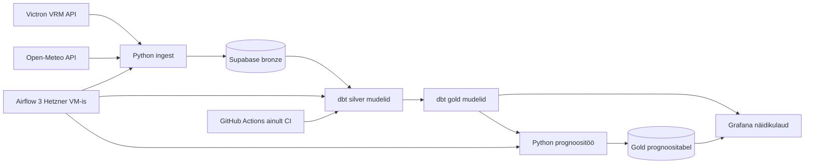

# UT Solar Energy Analytics Platform - Arhitektuur

## Äriküsimus

Kuidas mõjutavad ilmastikutingimused off-grid paigaldise energiatootmist ning kui
täpselt on võimalik prognoosida järgmise päeva päikeseenergia tootmist?

**Mõõdikud:**
1. Järgmise päeva tootmise prognoosiviga (MAE, kWh).
2. Tegeliku ja prognoositud päevase tootmise erinevus (kWh).
3. Tegeliku ja prognoositud päevase tootmise erinevus (%).

## Arhitektuur



Täpsem kirjeldus: see dokument

## Andmestik

| Allikas | Tüüp | Ajas muutuv? | Roll |
|---------|------|-------------|------|
| VRM API | API | Jah, iga 15 min tagant | Põhiandmevoog |
| Open Meteo | API | Jah, ilmamudel uueneb iga 6h tagant | Kõrvalvoog |

## Stack

| Komponent | Tööriist |
|-----------|---------|
| Sissevõtt | Airflow, Python |
| Transformatsioon | SQL, dbt |
| Andmehoidla | PostgreSQL |
| Prognoos | Python |
| Näidikulaud | Grafana |
| Orkestreerimine | Airflow |

## Käivitamine

```bash
# 1. Klooni repo ja liigu kausta
git clone <repo-url>
cd <projekti-kaust>

# 2. Kopeeri keskkonnamuutujad
cp .env.example .env
# Muuda .env failis paroolid ja muud seaded vastavalt vajadusele

# 3. Käivita teenused
docker compose up -d --build

# 4. [Vabatahtlik: käivita sissevõtt käsitsi esimesel korral]
# docker compose exec pipeline python scripts/run_pipeline.py run-all
```

Airflow (kui kasutatakse): http://localhost:8080 (kasutaja: airflow / parool: airflow)
Näidikulaud: http://localhost:[PORT]

## Saladused ja konfiguratsioon

Kõik saladused (paroolid, API võtmed, andmebaasi URL-id) on `.env` failis. Repos on ainult `.env.example`, mis näitab vajalike muutujate struktuuri ilma tegelike väärtusteta.

Vajalikud muutujad:

| Muutuja | Tähendus | Näide |
|---------|----------|-------|
| `DB_PASSWORD` | PostgreSQL parool | (saladus) |
| `[teised]` | ... | ... |

## Andmevoog lühidalt

1. **Sissevõtt** — [Kirjelda, kuidas andmed allikast kätte saadakse]
2. **Laadimine** — Andmed laaditakse `staging` kihti
3. **Transformatsioon** — [Kirjelda peamised arvutused ja mudelid]
4. **Testimine** — [Mitu] andmekvaliteedi testi kontrollivad korrektsust
5. **Näidikulaud** — [Kirjelda lühidalt, mida näidikulaud näitab]

## Andmekvaliteedi testid

Projekt kontrollib järgmist:

1. [Test 1 - nt: kasutajate ID on unikaalne]
2. [Test 2 - nt: tellimuse summa pole null]
3. [Test 3 - nt: kuupäev jääb vahemikku 2020-2026]

[Lisa rohkem, kui sul on]

Testide tulemused: [kuhu salvestatakse / kuidas vaadata]

## Projekti struktuur

```
.
├── README.md
├── compose.yml
├── .env.example
├── .gitignore
├── docs/
│   ├── arhitektuur.md      ← nädal 1 väljund
│   └── progress.md         ← nädal 2 väljund
└── ...                     ← ülejäänud projektifailid
```
## Riskid

1. Väliste API-de ajutised tõrked või limiidid mõjutavad ingest-i stabiilsust.
2. Vale või puudulik konfiguratsioon (.env, saladused) katkestab DAG-jooksud.
3. Piiratud VM ressursid (2 vCPU/4 GB) võivad tekitada koormuspiike ja viivitusi.

## Kokkuvõte, puudused ja võimalikud edasiarendused

**Kokkuvõte:**
- [Loetle, mis on lõpule viidud, mis töötab hästi]

**Puudused:**
- [Loetle ausalt, mis jäi tegemata - see ei mõjuta hinnet negatiivselt, vaid aitab hinnata]

**Mis edasi:**
- [Mida tahaksid edasi teha, kui aega oleks rohkem]

## Meeskond

| Nimi | Roll |
|------|------|
| Joose Rooso | Infra, prognoos, näidikulaud |
| Triinu Lepp | VRM API valmendus, transformatsioon, testid |
| Olena Nedozhogina | Meteo API valmendus, transformatsioon, testid |
