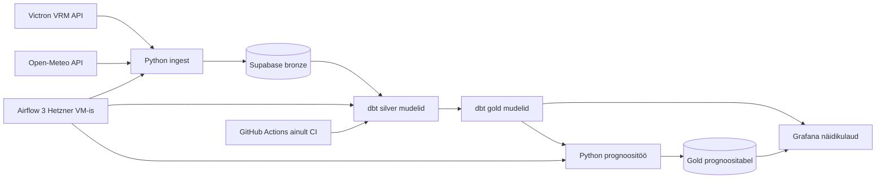

# Arhitektuuriskeem

## Äriküsimus

Kuidas mõjutavad ilmastikutingimused off-grid paigaldise energiatootmist ning kui
täpselt on võimalik prognoosida järgmise päeva päikeseenergia tootmist?

## Mõõdikud

- Järgmise päeva tootmise prognoosiviga (MAE, kWh).
- Tegeliku ja prognoositud päevase tootmise erinevus (kWh).
- Edukalt lõppenud `pipeline_smoke_test` DAG-runide osakaal.

## Andmeallikad

- Victron VRM API: telemeetriaandmed
- Open-Meteo API: ilmavaatlused/prognoosid

## Tehnilised kokkulepped

- Ajatsoon: UTC
- Andmete värskendamise intervall: 1h
- Võtmed: `site_id + timestamp_utc`
- Idempotentsus: upsert (`ON CONFLICT DO UPDATE`)
- Kihid: `bronze -> silver -> gold`
- Orkestreerimine: Airflow 3 (peamine scheduler), GitHub Actions ainult CI/manuaalne kontroll

## Tiimi tööjaotus

- Andmeingest: VRM + Open-Meteo allikad, toorandmete laadimine.
- Andmetransformatsioon ja kvaliteet: dbt mudelid ning DQ testid.
- Orkestreerimine ja opereerimine: Airflow, juurutus, kasutajahaldus, tööjuhendid.
- Näidikulaud ja prognoos: KPI-d, visualiseerimine, prognoositöö.

## Peamised riskid

- Väliste API-de ajutised tõrked või limiidid mõjutavad ingest-i stabiilsust.
- Vale või puudulik konfiguratsioon (`.env`, saladused) katkestab DAG-jooksud.
- Piiratud VM ressursid (2 vCPU/4 GB) võivad tekitada koormuspiike ja viivitusi.

## Keskse VM suurus (Hetzner)

### Miinimum (tootmiskatse / low load)
- 2 vCPU
- 4 GB RAM
- 40 GB SSD

### Soovituslik (stabiilsem tiimitöö)
- 4 vCPU
- 8 GB RAM
- 80 GB SSD

### Miks soovituslik
- Airflow API server + scheduler + metadata DB + dbt jooksud vajavad tipukoormusel rohkem mälu.
- 8 GB jätab puhvri logidele, korduskatsetele ja paralleelsetele taskidele.
